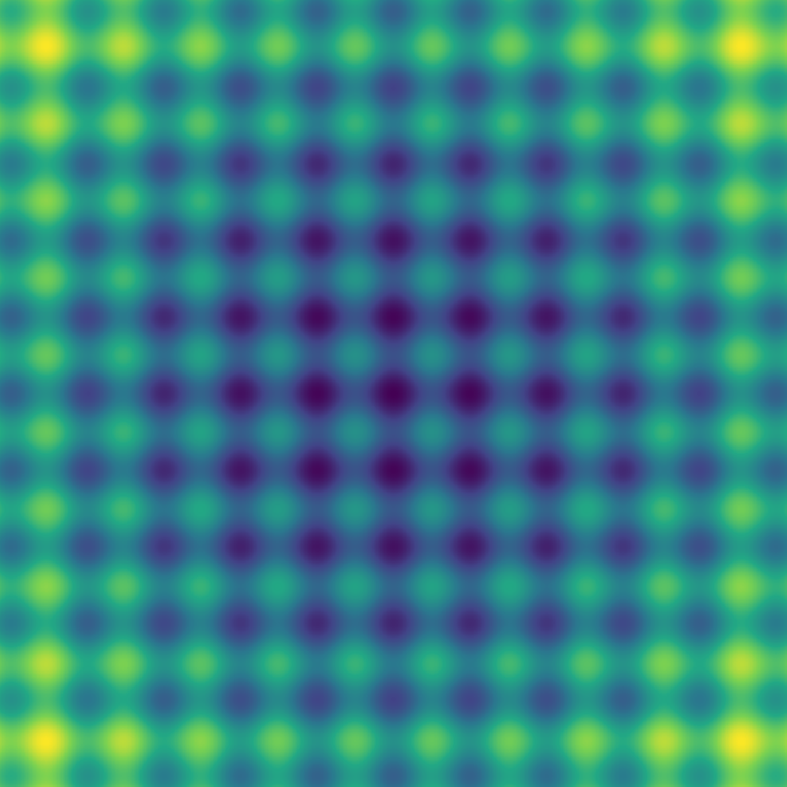

# Heatmap

## What is it?

Heatmap is library for 3d graphing with third dimension being data described as color. Comes with lightweight highly scalable engine that can be run inside docker and/or web service.

> Describe the data, Heatmap renders it.

Example Rastrigin function with Viridis color palette produced by this library:

## What is it for?

Visualization of all kinds of data. Examples being: Fourier transform of sound wave, heat information from infrared camera, weather information on a map and many more.

## How does it work?

For technical overview see [HOWTO](./docs/HOWTO.md).

Written in .NET6, unit and functionally tested. Uses `System.Vector` for all positioning information and `double` for sampling.

Fresh and compiling [samples](./samples/) always available.